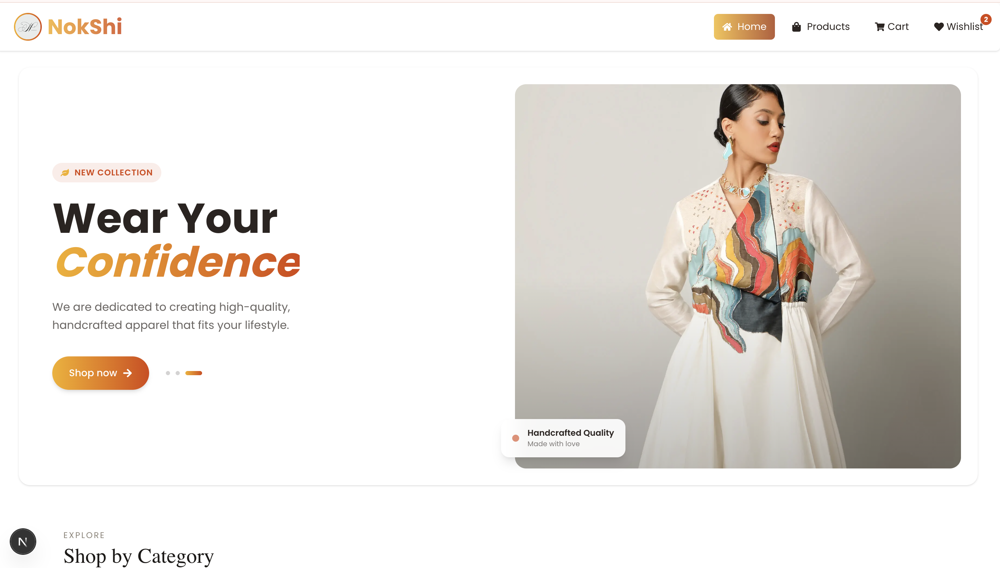
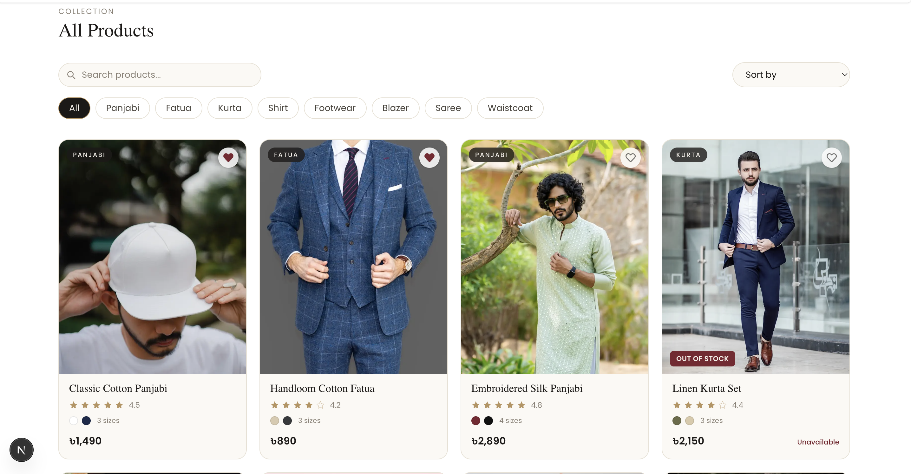
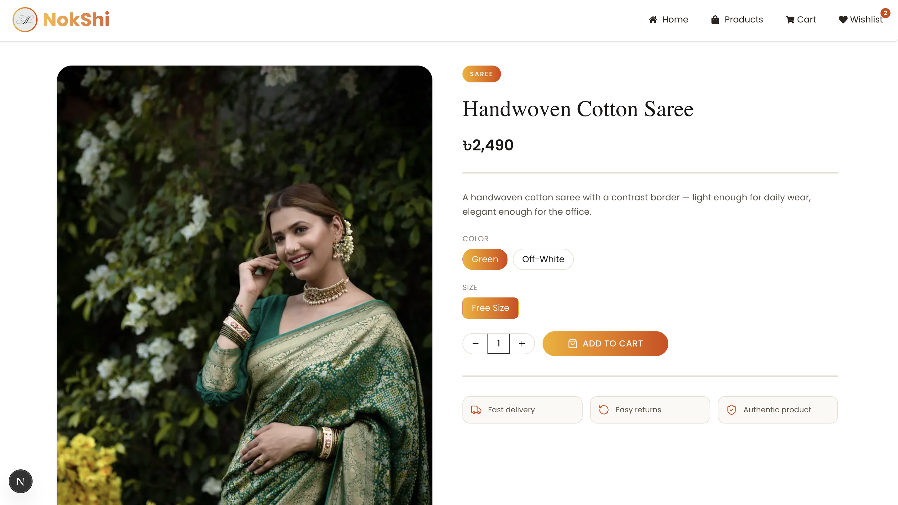

# NokShi — Fashion Store 🧵

A modern, fully responsive frontend for a fashion e-commerce store, built as part of the **Oxivos Frontend Developer — Round 1 Project Task**. NokShi showcases panjabis, kurtas, sarees, and more with a clean, premium shopping experience — smooth animations, a working cart, and a wishlist, all running on local dummy data.

**Live Site:** [nokshi.vercel.app](#) &nbsp;•&nbsp; **Repository:** [github.com/your-username/nokshi](#)

---

## ✨ Preview

### Hero Section




---

## 🛍️ Features

- **Animated Hero Section** — auto-playing image crossfade slider with a subtle Ken Burns zoom effect, built with Framer Motion
- **Product Listing** — responsive grid with category filtering
- **Product Details** — full product info with color/size selection and Add to Cart
- **Cart** — quantity controls, live totals, persisted to `localStorage`
- **Wishlist** — one-click save/remove from any product card, badge counter in the navbar, persisted to `localStorage`
- **Sticky, Scroll-Aware Navbar** — glassmorphism blur + shrink on scroll, hides on scroll-down and reappears on scroll-up
- **Loading & Empty States** — skeleton/spinner loaders and a friendly empty-cart / empty-wishlist view
- **Fully Responsive** — clean layout across mobile, tablet, and desktop

---

## 🧱 Tech Stack

| Tech | Purpose |
|---|---|
| **Next.js (App Router)** | Framework & client-side routing |
| **React Context + useReducer** | Cart & Wishlist state management |
| **Tailwind CSS + DaisyUI** | Styling & UI primitives |
| **Framer Motion** | Page/section animations, hero slider, micro-interactions |
| **React Icons** | Iconography |
| **localStorage** | Persisting cart & wishlist between sessions |

---

## 📁 Project Structure

```
src/
├── app/
│   ├── page.jsx                # Home
│   ├── products/
│   │   ├── page.jsx            # Product listing
│   │   └── [id]/page.jsx       # Product details
│   ├── cart/page.jsx           # Cart
│   └── wishlist/page.jsx       # Wishlist
├── components/
│   ├── layout/
│   │   ├── NavBar.jsx
│   │   └── MyLink.jsx
│   └── product/
│       ├── Hero.jsx
│       ├── ProductCard.jsx
│       └── ProductGrid.jsx
├── context/
│   └── ProductContext.js       # Cart & Wishlist provider
└── data/
    └── products.js             # Local dummy product data
```

---

## 🚀 Getting Started

Clone the repo and install dependencies:

```bash
git clone https://github.com/your-username/nokshi.git
cd nokshi
npm install
```

Run the development server:

```bash
npm run dev
```

Open [http://localhost:3000](http://localhost:3000) to view it in the browser.

---

## 🗂️ Dummy Data

All products are served from a local data file (`src/data/products.js`) — no backend or database required. Each product follows this shape:

```json
{
  "id": 1,
  "name": "Classic Cotton Panjabi",
  "category": "Panjabi",
  "price": 1490,
  "image": "https://images.unsplash.com/...",
  "hoverImage": "https://images.unsplash.com/...",
  "rating": 4.5,
  "colors": ["White", "Navy"],
  "sizes": ["M", "L", "XL"],
  "inStock": true,
  "description": "Short product description..."
}
```

---

## 📦 Deployment

Deployed on [Vercel](https://vercel.com). Every push to `main` triggers an automatic redeploy.

```bash
npm run build
```

---

## 📝 Notes

This project was built for the Oxivos Frontend Developer Round 1 assignment, focusing on clean component architecture, real-world edge case handling (empty states, out-of-stock items), and a polished, production-quality UI.

---

## 📬 Contact

Built by **[Your Name]**
📧 your.email@example.com